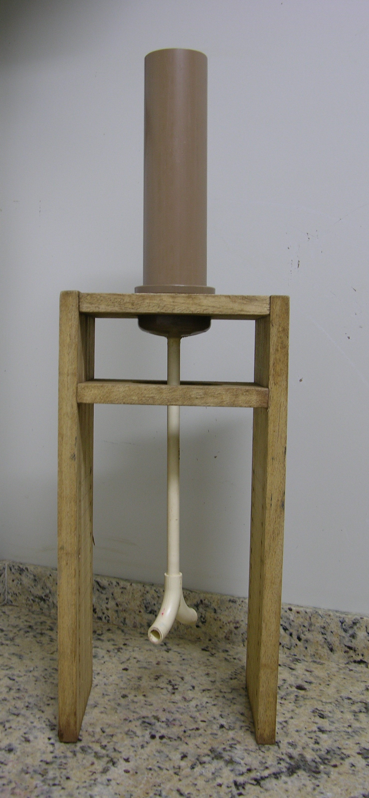

<!-- Revista Scientia Agraria -->
<!-- http://revistas.ufpr.br/agraria/about/editorialPolicies#custom-0  -->

```{r, echo=FALSE, message=FALSE, warning=FALSE}
require(magrittr)
library(dplyr)
```


# RESUMO

**PALAVRAS-CHAVE**

Title

# ABSTRACT

**KEYWORDS**

# INTRODUÇÃO

A erosão do solo constitui uma das maiores preocupações da ciência do solo moderna [@PanagosEtAl2017]. Por esse motivo, milhares de parcelas de monitoramento de erosão estão distribuídas ao redor do globo [@Boix-FayosEtAl2006]. Isso possibilita gerar um grande volume de informações. De posse desse volume de dados é possível observar que existe uma grande variação nas taxas de erosão medidas [@Boix-FayosEtAl2006], as quais se devem tanto a variabilidade natural como das medições [@NearingEtAl1999]. Contudo, essa variação raramente é quantificada e as suas causas não são explicitadas, o que dificulta a avaliação de modelos de erosão do solo e o delineamento de experimentos de monitoramento da erosão do solo [@NearingEtAl1999].

Uma fonte potencial de variação é o método usado na coleta de subamostras da enxurrada coletada nas parcelas de monitoramento. O método consiste em “homogeneizar bem, com uma das mãos, a enxurrada no balde de concentração do sedimento e, com a outra mão, sem parar a homogeneização, retirar uma amostra mergulhando um frasco de volume conhecido e de boca larga no seio da suspensão” [@Cogo1978; @VeigaEtAl1993]. Os inconvenientes desse método estão relacionados à impossibilidade do procedimento ser repetido por diferentes indivíduos e à incapacidade de se obter uma amostra homogênea dentro do tanque de concentração do sedimento [@TodiscoEtAl2012]. Como consequência, ocorre uma subestimativa da concentração de sedimento na enxurrada coletada [@Lang1992; @ZoebischEtAl1996]. Apesar disso, esse método de subamostragem da enxurrada é adotado na grande maioria dos projetos de monitoramento da erosão do solo, inclusive naqueles utilizados para a construção dos modelos de erosão do solo como a Equação Universal de Perda de Solo (EUPS) (CITAÇÃO).

Uma das alternativas é a construção de curvas de calibração [@TodiscoEtAl2012]. A enxurrada é homogeneizada e coletada em diferentes profundidades no tanque de sedimentação, sendo os dados utilizados para construção de um perfil de sedimentação. Após a integração da curva do perfil de sedimentação, calcula-se a concentração média, que é corrigida em função da curva de calibração, sendo esta função da altura da lâmina d’água. Mas o maior problema desse método continua sendo a fase de homogeneização da amostra de enxurrada, ainda mais difícil se a concentração de sedimento (e de areia grossa neste) for grande [@TodiscoEtAl2012]. A melhor alternativa parece ser o uso de fracionadores como o ‘churn splitter’ e o ‘cone splitter’ adotados pelo U.S. Geological Survey. Esses fracionadores dispensam a fase de homogeneização da amostra, garantindo a repetibilidade do procedimento e a produção de subamostras com constituição similar à amostra fracionada [@HorowitzEtAl2001]. Contudo, esses fracionadores não estão disponíveis no mercado brasileiro e apresentam um elevado custo para aquisição e importação (o ‘churn splitter’ custa US$ 5.587,00 e o ‘cone splitter’ custa US$ 1.175,00 (Rickly Hydrological Company®, 2011)). Isso inviabiliza a aquisição de tais equipamentos por muitos grupos de pesquisa. Assim, nosso objetivo é apresentar um equipamento que pode ser construído com materiais facilmente encontrados no mercado a um baixo custo. Além disso, mostramos que esse equipamento permite a obtenção de subamostras representativas de amostras de enxurrada, com desempenho superior ao método tradicional de coleta.

# MATERIAL E MÉTODOS

## Material do solo

O experimento foi realizado utilizando suspensões criadas em laboratório. As suspensões foram produzidas utilizando material do solo coletado da parte superficial (0--20 cm de profundidade) do horizonte A de perfil do solo derivado de LITOLOGIA, sem uso antrópico aparente, localizado no *campus* da Universidade Federal de Santa Maria a latitude -29°42'47,01"N e longitude -53°42'43.36"E. Esse perfil fora classificado por @Lauermann2007, segundo o Sistema Brasileiro de Classificação de Solos [@SantosEtAl2006], como Argissolo Vermelho-Amarelo Distrófico típico, classe essa representante da unidade de mapeamento São Pedro do levantamento de solos do Rio Grande do Sul [@LemosEtAl1973]. O perfil possui uma sequência de horizontes A-E-Bt-C, com conteúdo de argila muito baixo em superfície, mas que aumenta consideravelmente em profundidade -- com efeito direto sobre a densidade e a porosidade do solo. O baixo conteúdo de cátions básicos, fósforo e matéria orgânica refletem a pobreza de nutrientes no material de origem (Tabela \@ref(tab:perfil-do-solo)).

```{r perfil-do-solo, echo=FALSE, message=FALSE, warning=FALSE}
# Se necessário, instalar pacote febr
if (!require(febr)) {
  if (!require(devtools)) {
    install.packages("devtools")
  }
  devtools::install_github("samuel-rosa/febr")
}

# Descarregar dados do febr
perfil <- febr::layers("ctb0013", which.cols = "all", progress = FALSE)[[1]]

# Preparar tabela com dados físicos perfil
perfil$d <- glue::glue("{perfil$profund_sup}-{perfil$profund_inf}")
perfil_fis <- select(
  perfil, 
  Horizonte = camada_nome, Profundidade = d, 'Areia grossa' = areia_grossa, 'Areia fina' = areia_fina, 
  'Argila total' = argila_total, 'Densidade do solo' = densidade_aparente, 
  'Densidade de partícula' = densidade_particula, 'Macroporosidade' = macroporosidade, 
  'Microporosidade' = microporosidade)
idx <- c(4, ncol(perfil), 9:15)
unidades <- attr(perfil, 'units')[idx]
unidades <- gsub("^3", "^3^", unidades, fixed = TRUE)
unidades[1:2] <- c("", "cm")
colnames(perfil_fis) <- glue::glue("{colnames(perfil_fis)}<br>{unidades}")

# Preparar tabela com dados químicos perfil
perfil_qui <- dplyr::select(
  perfil, 
  camada_nome, d, ph_agua, ca_trocavel, mg_trocavel, k_trocavel, acidez_potencial, p_assimilavel, 
  materia_organica)
colnames_qui <- c(colnames(perfil_fis)[1:2], "pH", "Ca^2+^", "Mg^2+^", "K^+^", "H+Al", "P", "MO")
idx <- c(4, ncol(perfil), 16:22)
unidades <- attr(perfil, 'units')[idx]
unidades <- gsub("^2", "^2^", unidades, fixed = TRUE)
unidades <- gsub("cmolc", "cmol~c~", unidades, fixed = TRUE)
unidades[1:3] <- ""
colnames_qui[-c(1:2)] <- glue::glue("{colnames_qui[-c(1:2)]}<br>{unidades[-c(1:2)]}")
colnames_qui <- glue::glue("**{colnames_qui}**")
colnames(perfil_qui) <- colnames(perfil_fis)

# Tabela
rbind(perfil_fis, colnames_qui, perfil_qui) %>% 
  knitr::kable(
    booktabs = TRUE,
    caption = 'Variáveis físicas e químicas do perfil do solo usado como fonte de material para desenvolvimento dos experimentos de laboratório [@Lauermann2007].')
```

O material coletado do solo foi caracterizado quanto à distribuição do tamanho de partículas. Para isso ele foi seco ao ar, destorroado e passado em peneira com malha com abertura de dois milímetros. A conteúdo de argila da fração terra fina seca ao ar (TFSA) resultante foi estimado usando o método da pipeta após dispersão química de 20 g de TFSA com hidróxido de sódio (NaOH) -- na concentração de 1 mol L^-1^ -- e desagregação mecânica -- usando duas esferas de nylon (diâmetro de 1,71 cm, massa de 3,04 g, densidade de 1,11 g cm^-1^) e agitação horizontal por 4 horas a 120 ciclos por minuto. Já o conteúdo de areia foi determinado via tamizamento úmido.

## Método tradicional

A primeiro teste realizado foi quanto à capacidade do método tradicional produzir amostras que possuam a mesma concentração de sólidos totais (sedimentos) que a suspensão (enxurrada) de onde foi obtida, ou seja, se a amostra gerada é representativa da suspensão. Para isso foram utilizados recipientes plásticos com capacidade para 10 L, dentro dos quais foram adicionados 3 L de água destilada e a quantidade de TFSA necessária para atingir as concentrações de 2, 10 e 50 g L^-1^ de sólidos totais. Para cada concentração foram preparadas cinco repetições (baldes). Em cada balde, uma pessoa homogeneizou a suspensão com uma das mãos. Após 20 segundos, sem parar a homogeneização, outra pessoa coletou uma amostra mergulhando, no seio da suspensão, um copo de Beaker de 250 mL. A concentração de sólidos totais nas amostras de cada suspensão foi determinada em função do seu volume e da massa de sólidos totais mensurada após secagem em estufa à temperatuda de 105°C até completa evaporação da água. 

## Equipamento fracionador

O equipamento fracionador foi construído com peças de PVC (Figura \@ref(fig:sample-splitter)). Ele é composto de um reservatório para a suspensão na parte superior, o qual consiste num cano de 300 mm de comprimento e 75 mm de diâmetro, com capacidade para 1 L de suspensão. O fundo do reservatório possui formato de funil para direcionar a suspensão a um cano conectado à sua extremidade inferior, cano esse que possui 300 mm de comprimento e 15 mm de diâmetro. A função desse cano de menor diâmetro é dirigir a suspensão em fluxo contínuo até o dispositivo fracionador da suspensão, que possui formato de Y invertido e que está conectado à extremidade do primeiro. Todas as peças são fixadas utilizando material adesivo específico para PVC. Como o equipamento fracionador possui duas saídas (A e B), ele produz duas subamostras da suspensão a cada operação de fracionamento. O nivelamento do equipamento fracionador com os planos horizontal e vertical é feito usando usando uma plataforma de madeira. O investimento necessário para construção do equipamento fracionador é de aproximadamente [R$ VALOR].

O equipamento fracionador que apresentamos é construído com peças de PVC (Figura \@ref(fig:sample-splitter)). Ele é composto de um reservatório na parte superior, constituído por um cano de 300 mm de comprimento e 75 mm de diâmetro com capacidade para 1 L, o qual possui um fundo no formato de funil para direcionar a amostra a um cano de 300 mm de comprimento e 15 mm de diâmetro. A função desse cano é dirigir a suspensão em um fluxo contínuo até o dispositivo fracionador com formato de Y invertido, o qual está localizado na sua parte inferior. Todas as peças são fixadas utilizando material adesivo específico para PVC. Como o fracionador possui duas saídas ele produz duas subamostras a cada operação de fracionamento. O equipamento fica instalado sobre uma plataforma de madeira nivelada com o plano horizontal.

```{r sample-splitter, echo=FALSE, fig.cap="Equipamento fracionador de amostras de enxurrada."}

```

Dois testes foram realizados com o fracionador para definir o volume da amostra e a concentração de sedimento abaixo do qual o equipamento apresenta desvios inaceitáveis e, portando, não deve ser utilizado. No primeiro caso utilizamos diferentes volumes de água (100, 300, 500 e 1000 mL) em cinco repetições. As duas subamostras produzidas foram coletadas em copos de Beaker e o seu volume determinado. No segundo caso utilizamos suspensões contendo a mesma concentração daquelas utilizadas para avaliar o método tradicional. O material foi agitado vigorosamente e vertido no reservatório do fracionador, sendo lavado com água destilada entre cada fracionamento. As duas subamostras foram coletadas em copos de Beaker de 250 mL e analisadas quanto ao seu volume e concentração total de sedimento. O sedimento foi analisado quanto à distribuição do tamanho de partículas através do método da pipeta. O objetivo foi testar o efeito do fracionamento na distribuição do tamanho de partículas nas subamostras produzidas por cada saída do fracionador.

Os resultados completos de todos os testes são apresentados juntamente com algumas estatísticas descritivas (média, desvio padrão, coeficiente de variação e erro percentual). O teste t foi utilizado para testar se o volume e a concentração de sedimento das subamostras são estatisticamente iguais aos valores esperados. O teste t para amostras pareadas foi utilizado para testar se o volume e a concentração de sedimento das subamostras produzidas pelas duas saídas do fracionador são estatisticamente iguais. Todas as análises foram realizadas utilizando o pacote stats no R (R Development Core Team, 2011).

# RESULTADOS E DISCUSSÃO

```{r, echo=FALSE, message=FALSE, warning=FALSE}
unidades <- readr::read_csv("../data/camada.csv",  n_max = 1)
dados <- readr::read_csv("../data/camada.csv",  na = "-", comment = "unidade", locale = readr::locale(decimal_mark = ","))
```

A distribuição do tamanho de partículas do material de solo consta de: areia (0,053--2,00 mm) = `r dplyr::filter(dados, objeto_id == "TFSA") %>% dplyr::summarise(mean = mean(areia_total)) %>% round()` g kg^-1^; argila (<0.002 mm) = `r dplyr::filter(dados, objeto_id == "TFSA") %>% dplyr::summarise(mean = mean(argila_total)) %>% round()` g kg^-1^.

Os resultados mostram que o método tradicional descrito por Cogo (1978) não proporciona a obtenção de subamostras representativas da enxurrada (Tabela 1). Em todas as três concentrações testadas observamos um erro negativo de 30% ou mais. Esse erro é significativo e prejudica a consistência do método, indicando que as estimativas anuais de erosão do solo em áreas agrícolas podem ser muito inferiores ao real. Os 500 milhões de toneladas de solo erodidos anualmente no Brasil segundo Bertoni & Lombardi Neto (1999) podem ser, na verdade, de 650 a 750 milhões de toneladas.

Como o método tradicional subestima a erosão do solo devido à amostragem seletiva das partículas mais finas, a distribuição do tamanho de partículas e a composição química do sedimento das subamostras devem ser significativamente diversas da amostra da enxurrada. Não realizamos testes para avaliar essas propriedades do sedimento por entendermos que o erro apresentado pelo método já é suficiente para confirmar sua inconsistência (Lang, 1992; Zöbisch et al., 1996; Todisco et al., 2012).

No que diz respeito ao fracionador modelo UFSM-1, os resultados mostram que o mesmo é eficiente na obtenção de subamostras de água pura (Tabela 2). Ambas as saídas produziram subamostras com volumes similares. Entretanto, o processo de fracionamento se torna menos eficiente para volumes pequenos de amostra (100 mL). Os maiores erros percentuais (negativo ou positivo) observados quando o volume de amostra é pequeno, são resultado do efeito turbilhão da água no interior do cano de 15 mm de diâmetro localizado abaixo do reservatório. A função desse cano é dirigir a água em um fluxo constante até o dispositivo fracionador. Mas parece que esse objetivo só é atingido quando o volume da amostra é superior a 250-300 mL. Assim, recomendamos o uso do fracionador apenas com amostras de volume superior a 250-300 mL.

Ao testar o uso do fracionador modelo UFSM-1 com amostras de enxurrada com concentração de sedimento entre 2,00 e 50,00 g L-1, verificamos mais uma vez que o mesmo é eficiente em produzir subamostras representativas (Tabela 3). Os erros percentuais não são significativos e sua tendência negativa é resultado do processo envolvido no vertimento da amostra de enxurrada dentro do reservatório do fracionador. Partículas de areia podem permanecer no interior do reservatório onde a amostra estava armazenada se o mesmo não for agitado vigorosamente e o material vertido rapidamente. Como consequência pode haver uma subestimativa da concentração de sedimento na enxurrada e, portando, da erosão do solo.

Dado que o fracionador modelo UFSM-1 produz subamostras com concentração de sedimento estatisticamente idêntica àquela da amostra de enxurrada, não há alteração significativa da distribuição do tamanho de partículas do sedimento (Tabelas 4 e 5). Da mesma maneira, as duas saídas (A e B) do equipamento possuem desempenho equivalente. A exceção é para as amostras de enxurrada contendo pequena concentração de sedimento (2 g L-1), para as quais um erro percentual significativo é observado. Contudo, esse resultado não se deve ao processo de fracionamento, mas sim ao problema descrito acima, em que partículas de areia podem permanecer no interior do reservatório onde a amostra de enxurrada estava armazenada.

No caso da argila observamos que o erro percentual é superior ao da areia. Com isso, o conteúdo de argila nas subamostras obtidas da suspensão com concentração de sedimento de 2,00 g L-1 é inferior ao limite de detecção do método analítico utilizado. Novamente o erro percentual negativo deve ser resultado da permanência de resíduos do sedimento no interior do recipiente em que a amostra de enxurrada estava armazenada. Quando a concentração de sedimento é maior o erro percentual não é significativo, podendo o mesmo ser esperado para sedimentos contendo maior conteúdo de argila.

Em resumo, o método tradicional de coleta de subamostras de enxurrada é inadequado porque subestima a concentração de sedimento. Além disso, ele é fonte de variação nos resultados de erosão do solo. Por isso, acreditamos que seja necessário quantificar esse efeito como forma de determinar a incerteza associada às funções utilizadas para estimar a erodibilidade do solo (fator K da EUPS), bem como dos modelos de estimativa da erosão do solo. Infelizmente a incerteza associada a funções e modelos matemáticos foi negligenciada durante muito tempo (McBratney et al., 2011). Mas atualmente essa informação se tornou essencial (Finke, 2012). Ênfase deve ser dada a EUPS, modelo de estimativa de erosão mais utilizado por cientistas do solo e tomadores de decisão.

Por outro lado, o equipamento fracionador modelo UFSM-1 é eficiente em produzir subamostras de enxurrada sem alterar a distribuição do tamanho de partículas do sedimento. Com isso, acreditamos que não deva ocorrer qualquer alteração significativa nas propriedades químicas do sedimento. Mas para que isso seja possível as amostras de enxurrada devem possuir volume superior a 250-300 mL e concentração de sedimento superior a 2 g L-1. Futuras avaliações do fracionador devem envolver um intervalo maior de concentração de sedimentos e distribuição do tamanho de partículas, bem como o potencial de contaminação das subamostras por constituintes orgânicos e inorgânicos.

Apesar dos resultados positivos, reconhecemos que o uso do fracionador modelo UFSM-1 pode ser de difícil operacionalização para volumes grandes de amostra de enxurrada (>100 L). Nesse sentido, torna-se necessário avaliar a possibilidade de desenvolver um equipamento com maior capacidade de processamento e desempenho semelhante. Se o monitoramento da erosão do solo constitui tarefa fundamental dos cientistas do solo, devemos contar com equipamentos que permitam a obtenção de dados com a maior acurácia possível.

# CONCLUSÕES

# AGRADECIMENTOS

# REFERÊNCIAS
