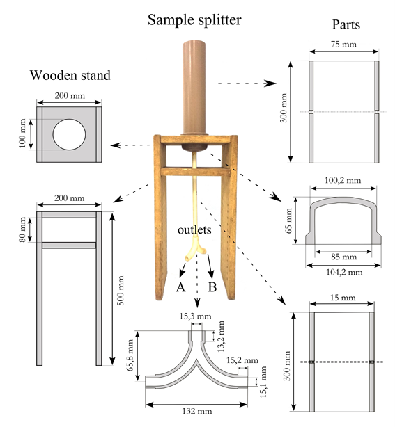

<!-- Primeira versão: -->
<!-- Revista Brasileira de Ciência do Solo -->
<!-- https://www.rbcsjournal.org/ -->

<!-- Segunda versão: -->
<!-- Revista Scientia Agraria -->
<!-- http://revistas.ufpr.br/agraria/about/editorialPolicies#custom-0  -->

<!-- Terceira versão (atual): -->
<!-- Scientia Agricola -->
<!-- http://www.esalq.usp.br/scientia/ -->

```{r setup, echo=FALSE, message=FALSE, warning=FALSE}
library(magrittr)
library(dplyr)
library(pander)
library(lattice)
library(sf)
source("helper.R")

# Opções para tabelas
panderOptions('decimal.mark', ',')
panderOptions('table.split.table', Inf)
panderOptions('keep.trailing.zeros', TRUE)
panderOptions('table.alignment.default', 'left')
# panderOptions('table.caption.prefix', 'Table: ')

# Opções para figuras
# a <- trellis.par.get("axis.text")
# a$fontfamily <- "serif"
# trellis.par.set(name = "axis.text", value = a)
# a <- trellis.par.get('par.xlab.text')
# a$fontfamily <- "serif"
# trellis.par.set(name = 'par.xlab.text', value = a)
# a <- trellis.par.get('par.ylab.text')
# a$fontfamily <- "serif"
# trellis.par.set(name = 'par.ylab.text', value = a)
```

<!-- 
**RESUMO**: O método usado para obtenção das amostras de enxurrada coletada em estudos de monitoramento da
erosão do solo é uma importante fonte de variabilidade dos dados. Nesse estudo avaliamos o método manual de 
amostragem usado no Brasil. Apresentamos como alternativa o protótipo de um equipamento fracionador de 
suspensões com grande concentração de sólidos totais. Usando material do solo com 583 g k^-1^ de areia e 89 
g k^-1^ de argila, o método manual e o fracionador foram testados quanto à sua capacidade de produzir amostras
representativas de suspensões com concentração de 2, 10 e 50 g L^-1^ de sólidos totais. Uma subestimativa de 
30% ou mais da concentração de sólidos totais foi observada usando o método manual, com variação de mesma 
magnitude (CV entre 20 e 45%). Já o fracionador foi eficiente em produzir amostras representativas da suspensão
fracionada -- inclusive sem alterar a granulometria dos sólidos totais. Tanto os erros percentuais absolutos 
(EM < |5%|), como a variação entre as repetições (CV < 3%), foram pequenos. Os problemas com o método manual se
devem a homogeneização ineficiente que facilita a sedimentação diferencial das partículas de diferentes
tamanhos.
Caso esses problemas sejam encontrados também em outros estudos, o protótipo que desenvolvemos se apresenta 
como uma alternativa bastante razoável.

**PALAVRAS-CHAVE** -- monitoramento da erosão, perda de solo, solo arenoso, fracionador amostral, incerteza.
 -->

<!-- Five preferred reviewers -->

<!-- First/Given Name: Panos -->
<!-- Last/Family Name: Panagos -->
<!-- Email: panos.panagos@ec.europa.eu -->
<!-- Institution: European Comission Joint Research Centre -->
<!-- Preference: I recommend this Reviewer -->
<!-- Reason: He has a PhD in soil erosion modelling and developed various studies on soil erosion factors. -->

<!-- First/Given Name: José María -->
<!-- Last/Family Name: García-Ruiz -->
<!-- Email: humberto@ipe.csic.es -->
<!-- Institution: Instituto Pirenaico de Ecologia -->
<!-- Preference: I recommend this Reviewer -->
<!-- Reason: Coordinator of a network of experimental stations for monitoring and evaluation of erosion. -->

<!-- First/Given Name: Jamil Alexandre Ayach -->
<!-- Last/Family Name: Anache -->
<!-- Email: jamil.anache@usp.br -->
<!-- Institution: Universidade de São Paulo Escola de Engenharia de São Carlos -->
<!-- Preference: I recommend this Reviewer -->
<!-- Reason: Developed studies on erosion monitoring plots throughout Brazil. -->

<!-- First/Given Name: Mark A.  -->
<!-- Last/Family Name: Nearing -->
<!-- Email: mark.nearing@ars.usda.gov -->
<!-- Institution: USDA-ARS Southwest Watershed Research Center -->
<!-- Preference: I recommend this Reviewer -->
<!-- Reason: Recognized as an international leader in the areas of erosion processes and erosion modeling. -->

<!-- First/Given Name: Jean Paolo Gomes -->
<!-- Last/Family Name: Minella -->
<!-- Email: jminella@gmail.com -->
<!-- Institution: Universidade Federal de Santa Maria Centro de Ciencias Rurais -->
<!-- Preference: I recommend this Reviewer -->
<!-- Reason: Reference in Brazil in the monitoring and modeling of erosive processes in watersheds. -->

__Running title:__ Accuracy of runoff sampling methods

__Manuscript category:__ Soils and Plant Nutrition

<br>

__Accuracy and variability of runoff sampling methods__

<br>

Alessandro Samuel-Rosa^1\*^, Jean Michel Moura-Bueno^2^, Ricardo Simão Diniz Dalmolin^3^
<br>

^1^ Universidade Tecnológica Federal do Paraná -- Curso de Agronomia -- Prolongamento da Rua Cerejeira, s/n --
85892-000 -- Santa Helena, PR -- Brasil.

^2^ Universidade Federal de Pelotas -- Programa de Pós-Graduação em Manejo e Conservação do Solo e da Água -- Campus Universitário, s/n -- 96010-610 -- Capão do Leão, RS -- Brasil.

^3^ Universidade Federal de Santa Maria -- Departamento de Solos -- Av. Roraima 1000, Prédio 42, Sala 3309 --
97105-900 -- Santa Maria, RS -- Brasil.

\* Corresponding author <alessandrorosa@utfpr.edu.br>

PAGEBREAK

__ACCURACY AND VARIABILITY OF RUNOFF SAMPLING METHODS__

__ABSTRACT__ (maximum of 250 words)

The method used to obtain runoff samples in soil erosion monitoring studies is an important source of data variability. In this study, we evaluated the manual sampling method used in Brazil. We present as an alternative the prototype of a sample splitter for suspensions with high concentration of total solids. Using soil material with 583 g kg^-1^ of sand and 89 g kg^-1^ of clay, the manual method and the sample splitter were tested for their ability to produce representative samples of suspensions with a concentration of 2, 10 and 50 g L ^-1^ of total solids. An underestimation of 30% or more of the concentration of total solids was observed using the manual method, with a variation of the same magnitude (CV between 20 and 45%). The splitter was efficient in producing samples representative of the suspension -- even without altering the particle size distribution of the total solids. Both absolute percentage errors (|<5%|) and the variation between replicates (CV <3%) were small. The problems with the manual method are due to the inefficient homogenization that facilitates the differential sedimentation of the particles of different sizes. If these problems are also found in other studies, then the prototype that we developed is a reasonable alternative.

__Keywords:__ Erosion monitoring, Soil loss, Sandy soil, Sample splitter, Uncertainty.

PAGEBREAK

# INTRODUCTION (30 lines)

<!--
A erosão do solo constitui, há muitas décadas, uma das maiores preocupações dos cientistas do solo [@PanagosEtAl2017]. Prova disso são as milhares de parcelas de monitoramento da erosão, instaladas sob os mais diferentes tipos de solo e usos da terra, distribuídas ao redor de todo o planeta [@Garcia-RuizEtAl2015; @AnacheEtAl2017]. Uma das principais dificuldades encontradas na pesquisa em erosão do solo é a grande variabilidade dos dados [@NearingEtAl1999]. Essa variabilidade advém da diversidade de métodos e estratégias de monitoramento utilizados [@Boix-FayosEtAl2006; @Garcia-RuizEtAl2015]. Pesa negativamente também a falta de recursos para condução do monitoramento por período de tempo maior do que 5-10 anos necessário para obtenção de dados mais consistentes [@AnacheEtAl2017]. Distúrbios indesejados causado no solo durante a instalação e/ou condução do monitoramento da erosão são uma fonte de variação difícil de identificar [@Boix-FayosEtAl2006; @Kinnell2016]. Finalmente, há a complexidade do processo erosivo e a interação dos fatores determinantes que estão completamente fora do controle devido a limitações operacionais e de conhecimento [@Boix-FayosEtAl2006]. Na prática, quanto maior a variabilidade dos dados, maior a nossa incerteza sobre a magnitude das perdas de solo [@Garcia-RuizEtAl2015].
-->

Soil erosion is one of the major concerns of soil scientists [@PanagosEtAl2017]. Proof of this are the thousands of soil erosion monitoring plots distributed around the globe [@Garcia-RuizEtAl2015; @AnacheEtAl2017]. One of the main difficulties encountered in soil erosion research is the great variability of the data, which results from the diversity of methods and monitoring strategies employed [@NearingEtAl1999; @Boix-FayosEtAl2006; @Garcia-RuizEtAl2015; @Poesen2018]. Lack of resources for monitoring longer than 5-10 years to obtain more consistent data is also detrimental [@AnacheEtAl2017]. The greater the variability of the data, the greater our uncertainty about the magnitude of soil losses [@Garcia-RuizEtAl2015].

<!--
Uma outra importante fonte de variabilidade nos dados de perda do solo é o método usado para obtenção das amostras da enxurrada coletada nas parcelas de monitoramento [@Kinnell2016]. Isso porque, para que a amostra seja a mais representativa o possível da realidade, o processo de amostragem requer que a enxurrada coletada seja o mais perfeitamente homogeneizada. Tal homogeneidade é difícil de alcançar quando partículas de diferentes tamanhos estão presentes no sedimento, haja vista a atuação do processo de sedimentação diferencial [@CiesiolkaEtAl2006; @TodiscoEtAl2012; @Kinnell2016]. Os métodos baseados na homogeneização e amostragem manual da enxurrada coletada estão entre os que mais sofrem com esse problema [@ZoebischEtAl1996]. O resultado é que as amostras da enxurrada coletada tendem a subestimar a concentração de sedimento, sendo a magnitude da subestimativa proporcional à concentração de partículas de maior diâmetro [@Lang1992; @ZoebischEtAl1996; @CiesiolkaEtAl2006].
-->

An important source of variation in soil loss data is the method of sampling the runoff collected in erosion plots [@Kinnell2016]. A runoff sample should be as representative as possible of reality. This requires the collected runoff be perfectly homogenized. Such homogeneity is difficult to achieve when particles of different sizes are present in the sediment due to differential sedimentation [@CiesiolkaEtAl2006; @TodiscoEtAl2012; @Kinnell2016]. Previous studies suggested that manual sampling methods are among those that suffer the most from this problem, commonly resulting in underestimates of soil losses [@Lang1992; @ZoebischEtAl1996; @CiesiolkaEtAl2006]. For this reason, more elaborate sampling methods that account for differential sedimentation were proposed [@TodiscoEtAl2012]. But they still require the suspension to be homogenized beforehand. A reasonable alternative is to use sample splitters such as the cone and churn splitters, widely used for sampling water and suspensions with low concentration of total solids [@CapelEtAl1995; @HorowitzEtAl2001]. Sample splitters have an architecture and/or mode of operation that allows producing samples with constitution very similar to the original suspension without human intervention.

<!--
Estima-se que o volume de solo perdido anualmente no Brasil seja da ordem de 500 milhões de toneladas [@BertoniEtAl2012], com taxas médias de perda de solo que variam entre 0,1 e 136 Mg ha^-1^ ano^-1^ [@AnacheEtAl2017]. No caso de solo de textura arenosa, estima-se que as taxas de perda de solo possam facilmente chegar a mais 150 Mg ha^-1^ ano^-1^ [@LanzanovaEtAl2013]. No entanto, como parte considerável das estimativas brasileiras baseia-se no emprego de um método manual para amostragem da enxurrada coletada [@Cogo1978; @VeigaEtAl1993; @TengbergEtAl1997; @EltzEtAl2001; @AmadoEtAl2002a; @SilvaEtAl2005; @VolkEtAl2009; @CardosoEtAl2012; @CorreaEtAl2016], é possível que as perdas de solo sejam ainda maiores. Isso é especialmente preocupante no caso das áreas com solo de textura arenosa, haja vista a grande pressão de uso exercida pelo setor agropecuário-industrial. Nesse sentido, o primeiro objetivo desse estudo foi avaliar se o método manual usado no Brasil subestima as perdas de solo em área com solo de textura grosseira e, em sendo verificada essa tendência, quantificar sua magnitude.
-->

Erosion monitoring studies in Brazil indicate that, on average, soil losses range from 0.1 to 136 Mg ha^-1^ year^-1^ [@AnacheEtAl2017]. For sandy soil, it is estimated that soil losses can easily reach over 150 Mg ha^-1^ year^-1^ [@LanzanovaEtAl2013]. However, since a large part of the Brazilian estimates is based on the use of a manual method to sample the collected runoff [@VeigaEtAl1993; @TengbergEtAl1997; @EltzEtAl2001; @AmadoEtAl2002a; @SilvaEtAl2005; @VolkEtAl2009; @CardosoEtAl2012; @CorreaEtAl2016], it is possible that soil losses are even greater. This is especially worrying in the case of areas with sandy texture soil, given the existing pressures to introduce these areas in the agricultural production chain [@DonagemmaEtAl2016].

The objective of this study is twofold. First, to evaluate if the manual method of runoff sampling used in Brazil underestimates soil losses in areas with coarse texture soil and quantify the magnitude of this underestimate. Second, to develop and test a prototype sample splitter that can be used with suspensions with high concentration of total solids collected in erosion monitoring plots as an alternative for the manual sampling method.

<!--
Uma solução elegante para o problema da amostragem de enxurrada com sedimento contendo partículas de diferentes diâmetros foi proposta por Todisco et at. [-@TodiscoEtAl2012]. Contudo, o método continua sendo dependente da homogeneização da enxurrada coletada, o que é ainda mais difícil se a concentração de sedimento for grande [@TodiscoEtAl2012]. Uma alternativa razoável consiste em utilizar equipamentos fracionadores, como aqueles do tipo cone (*cone splitter*) e batedeira (*churn splitter*), amplamente utilizados para a amostragem de água e suspensões com pequena concentração de sólidos totais [@CapelEtAl1995; @HorowitzEtAl2001]. Seja pela sua arquitetura, seja pelo seu modo de funcionamento, esses equipamentos produzem amostras com constituição muito similar à suspensão fracionada. Nesse contexto, o segundo objetivo desse estudo foi desenvolver e testar o protótipo de um equipamento fracionador de suspensões com grande concentração de sólidos totais, característica de enxurradas coletadas em parcelas de monitoramento da erosão.
-->

# MATERIAL AND METHODS

## Soil material

<!-- 
Os dois métodos de fracionamento -- método manual e método do fracionador -- foram avaliados usando um experimento laboratorial que utilizou suspensões compostas de água destilada e material do solo. O material do solo foi coletado da parte superficial (0--20 cm de profundidade) do horizonte A de perfil do solo derivado de rochas sedimentares da Formação Santa Maria, sem uso antrópico aparente, localizado no *campus* da Universidade Federal de Santa Maria a latitude -29°42'47,01"N e longitude -53°42'43.36"E. Esse perfil fora classificado como um  da edição de 2006 do Sistema Brasileiro de Classificação de Solos [@Lauermann2007]. Ele possui uma sequência de horizontes A-E-Bt-C, com conteúdo de argila muito baixo em superfície, mas que aumenta consideravelmente em profundidade -- com efeito direto sobre a densidade e a porosidade do solo. O baixo conteúdo de cátions básicos, fósforo e matéria orgânica refletem a pobreza de nutrientes no material de origem (Tabelas \@ref(tab:perfil-fisica) e \@ref(tab:perfil-quimica)) -- os dados analíticos estão disponíveis no Repositório Brasileiro Livre para Dados Abertos do Solo (febr, www.ufsm.br/febr), conjunto de dados `ctb0013`. Características similares são encontradas na camada superficial do solo de grande parte da região da Depressão Central do estado do Rio Grande do Sul (Figura \@ref(fig:solos-do-rs)) [@StreckEtAl2008], tendo sido alvo de muitos estudos de monitoramento da erosão [@CogoEtAl1984; @EltzEtAl2001; @AmadoEtAl2002a; @VolkEtAl2009].
-->

The two sample splitting methods -- manual and splitter -- were evaluated in a controlled laboratory experiment using suspensions, composed of distilled water and fine soil material, created to simulate runoff samples. The soil material was collected from the upper part (0--20 cm depth) of the A horizon of a soil profile derived from sedimentary rocks of the Santa Maria Formation. Located at -29°42'47.01"N and -53°42'43.36"E, the profile had no apparent anthropic use, and was classified as an Argissolo Vermelho-Amarelo Distrófico típico in the Brazilian classification and as a Rhodic Acrisol in the international classification. With an A-E-Bt-C horizon sequence, the clay content is very low in the topsoil and increases considerably with depth, with a direct effect on the soil bulk density and porosity. The low content of basic cations, phosphorus and organic matter reflect the small availability of plant nutrients in the soil parent material (Tables \@ref(tab:perfil-fisica) and \@ref(tab:perfil-quimica)) -- the analytic data are available in the Free Brazilian Repository for Open Soil Data (febr, www.ufsm.br/febr), dataset `ctb0013`. Similar characteristics are found in the topsoil of a large portion of the Central Depression region of the Rio Grande do Sul state (Figure \@ref(fig:solos-do-rs)), having been the target of many erosion monitoring studies [@CogoEtAl1984; @EltzEtAl2001; @AmadoEtAl2002a; @VolkEtAl2009].

<br>

```{r perfil-fisica, echo=FALSE, message=FALSE, warning=FALSE}
# (Des)Carregar dados do febr e preparar unidades
# perfil <- febr::layers("ctb0013", which.cols = "all", progress = FALSE)[[1]]
# save(perfil, file = '../data/perfil.rda')
load('../data/perfil.rda')
perfil$Depth <- glue::glue("{perfil$profund_sup}-{perfil$profund_inf}")
attr(perfil, 'units') <- c(attr(perfil, 'units'), "cm")
attr(perfil, 'units') <- gsub("unitless", "-", attr(perfil, 'units'))
attr(perfil, 'units') <- gsub("g/cm^3", "g cm^-3^", attr(perfil, 'units'), fixed = TRUE)
attr(perfil, 'units') <- gsub("m^3/m^3", "m^3^ m^-3^", attr(perfil, 'units'), fixed = TRUE)
attr(perfil, 'units') <- gsub("g/kg", "g kg^-1^", attr(perfil, 'units'), fixed = TRUE)
attr(perfil, 'units') <- gsub("cmolc/kg", "cmol~c~ kg^-1^", attr(perfil, 'units'), fixed = TRUE)
attr(perfil, 'units') <- gsub("mg/L", "mg L^-1^", attr(perfil, 'units'), fixed = TRUE)
# attr(perfil, 'units') <- glue::glue("({attr(perfil, 'units')})")

# Preparar tabela com dados físicos perfil
# colnames(perfil)
idx <- c(4, 23, 9:15)
perfil_fis <- perfil[, idx]
col_nam <- c('ID', 'Bounds', 'Coarse sand', 'Fine sand', 'Clay', 'Bulk density', 'Particle density', 'Macro-porosity', 'Micro-porosity')
colnames(perfil_fis) <- glue::glue("{col_nam}<br>{attr(perfil, 'units')[idx]}")
pander::panderOptions('digits', c(0, 0, 0, 0, 0, 3, 3, 4, 4))
pander::panderOptions('table.split.cells', rep(100 / ncol(perfil_fis), ncol(perfil_fis)))
pander::pander(perfil_fis, caption = '(\\#tab:perfil-fisica) Physical properties of the soil profile horizons.')
```

<br>

```{r perfil-quimica, echo=FALSE, message=FALSE, warning=FALSE}
# Preparar tabela com dados químicos perfil
# colnames(perfil)
idx <- c(4, 23, 16:22)
perfil_qui <- perfil[, idx]
col_nam <- c('ID', 'Bounds', 'pH', "Ca^2+^", "Mg^2+^", "K^+^", "H+Al", "P~2~O~5~", "Organic matter")
colnames(perfil_qui) <- glue::glue("{col_nam}<br>{attr(perfil, 'units')[idx]}")
pander::panderOptions('digits', c(0, 0, 2, 3, 2, 2, 3, 3, 1))
pander::panderOptions('table.split.cells', rep(100 / ncol(perfil_qui), ncol(perfil_qui)))
pander::pander(perfil_qui, caption = '(\\#tab:perfil-quimica) Chemical properties of the soil profile horizons.')
```

<br>

```{r solos-do-rs, echo=FALSE, message=FALSE, warning=FALSE, fig.cap="Area of the state of Rio Grande do Sul with a superficial soil layer similar in texture to the soil material used in this study. The cross near the center of the state indicates the location where the soil material was collected.", fig.align='center', dpi=600, fig.asp=1, out.width='16.5cm'}
# Download limits of Brazilian states from IBGE
if (!file.exists("../data/vector/brasil.shp")) {
  gdalUtils::ogr2ogr(
    src_datasource_name = "WFS:https://geoservicos.ibge.gov.br/geoserver/wfs", 
    dst_datasource_name = "../data/vector/brasil.shp",
    layer = "CGEO:C02_limite_estadual_2010")
  brasil <- sf::st_read("../data/vector/brasil.shp", quiet = TRUE)
} else {
  brasil <- sf::st_read("../data/vector/brasil.shp", quiet = TRUE)
}
brasil %<>% mutate(col = ifelse(NomUF == "Rio Grande do Sul", "gray50", "white"))

# Load soil map
rs <- 
  sf::st_read("../data/vector/solo-rs.shp", quiet = TRUE) %>% 
  sf::st_transform(sf::st_crs(brasil))

# Criar variável do tipo fator para construção do gráfico. Cada polígono recebe um valor único.
rs$id <- 1:nrow(rs) %>% as.factor()

# Avaliação dos polígonos. A função 'grepl' retorna '1' quando atende ao critério, e '0' caso contrário.
# Assim, somamos os resultados para agregar os dados. Quanto maior o valor final, maior é o número de 
# critérios ao qual um polígono atende.
# as.factor(rs$SOLO_EMBRA) %>% levels
idx <- 
  grepl("Argissolo", rs$SOLO_EMBRA) + grepl("Planossolo", rs$SOLO_EMBRA) + grepl("Gleissolo", rs$SOLO_EMBRA) + 
  grepl("areia", rs$TEXTURA) + grepl("silt/arenito", rs$MAT_ORIGEM) + 
  grepl("siltito/argilito", rs$MAT_ORIGEM) + grepl("siltito", rs$MAT_ORIGEM) + grepl("arenito", rs$MAT_ORIGEM) +
  grepl("arenosa", rs$TEXTURA) - grepl("gnaissse", rs$MAT_ORIGEM) - grepl("granito", rs$MAT_ORIGEM) - 
  grepl("xisto", rs$MAT_ORIGEM) - grepl("riolito", rs$MAT_ORIGEM) - grepl("basalt", rs$MAT_ORIGEM) - 
  grepl("andesito", rs$MAT_ORIGEM) - grepl("lacustre", rs$MAT_ORIGEM) - grepl("Luvisssolo", rs$SOLO_EMBRA) -
  grepl("Espodossolo", rs$SOLO_EMBRA) - grepl("Neossolo", rs$SOLO_EMBRA) - grepl("Cambissolo", rs$SOLO_EMBRA)

# Número mínimo de critérios aos quais um polígono precisa atender
rs$col <- "gray98"
rs$col[idx >= 2] <- "gray50"

# Plot
plot(
  brasil[brasil$NomUF == "Rio Grande do Sul", "NomUF"], reset = FALSE, main = "", axes = TRUE, 
  col = "gray98", graticule = TRUE)
plot(rs["id"], border = "transparent", col = rs$col, reset = FALSE, add = TRUE)
plot(brasil, add = TRUE, reset = FALSE, col = "transparent")
points(-53.71327, -29.71289, pch = 3)
text(x = -56.1, y = -28.1, labels = "Argentina", srt = 50)
text(x = -55.5, y = -31.7, labels = "Uruguay", srt = -43)
text(x = -50.5, y = -27.7, labels = "Santa Catarina", srt = -38)
text(x = -50.3, y = -31.1, labels = "Atlantic Ocean", srt = 54)
ybottom <- st_bbox(rs)[c(2, 4)] %>% extendrange() %>% .[1]
xright <- st_bbox(rs)[c(1, 3)] %>% extendrange() %>% .[2]
rect(
  xleft = xright - 2.4, ybottom = ybottom, xright = xright - 0.1, ytop = ybottom + 2.00,
  col = "white", border = "black")
x1 <- 0.82; y1 <- 0.06; p <- 0.05; r <- bboxRatio(brasil)
par(fig = c(x1 = x1, x2 = x1 + p * r, y1 = y1, y2 = y1 + p), new = TRUE, pin = c(7, 7), 
    plt = c(0, 1, 0, 1))
plot(brasil, add = TRUE, col = brasil$col)
```

<br>

```{r, echo=FALSE, message=FALSE, warning=FALSE}
unidades <- readr::read_csv("../data/camada.csv",  n_max = 1)
locale <- readr::locale(decimal_mark = ",")
dados <- readr::read_csv("../data/camada.csv",  na = "-", comment = "unidade", locale = locale)
areia <- dplyr::filter(dados, objeto_id == "TFSA") %>% dplyr::summarise(mean = mean(areia_total)) %>% round()
argila <- dplyr::filter(dados, objeto_id == "TFSA") %>% dplyr::summarise(mean = mean(argila_total)) %>% round()
```

<!--
O material coletado do solo foi caracterizado quanto à distribuição do tamanho de partículas. Para isso ele foi seco ao ar, destorroado e passado em peneira com malha de dois milímetros de abertura. O conteúdo de argila (diâmetro < 0,002 mm) na fração terra fina seca ao ar (TFSA) resultante foi estimado usando o método da pipeta após dispersão química de ~20 g de TFSA com hidróxido de sódio (NaOH) -- na concentração de 1 mol L^-1^ -- e desagregação mecânica -- usando duas esferas de náilon (diâmetro do 1,71 cm, massa de 3,04 g, densidade de 1,11 g cm^-1^) e agitação horizontal por 4 horas a 120 ciclos por minuto. Já o conteúdo de areia (diâmetro entre 0,053 e 2,00 mm) foi determinado via tamisamento úmido. Segundo essas análises, a distribuição do tamanho de partículas do material de solo consta de `r areia[[1]]` g kg^-1^ de areia e `r argila[[1]]` g kg^-1^ de argila.
-->

The collected soil material was air-dried, crushed and passed through a 2-mm sieve. The particle size distribution of the resulting fine soil material was determined using three samples of about 20 g each. The total clay content (<0.002 mm diameter) was determined via the pipette method after chemical dispersion and mechanical disintegration. The first was achieved using 1 mol L^-1^ sodium hydroxide (NaOH). The latter consisted of horizontal stirring for 4 hours at 120 cycles per minute in the presence of two nylon spheres (diameter: 1.71 cm; mass: 3.04 g; density 1.11 g cm^-1^). The total sand content (0.053--2.00 mm diameter) was determined via wet sieving. The total silt (0.002--0.053 mm diameter) content was determined by difference. According to these analyzes, the particle size distribution of the fine soil material (0--20 cm) consists of `r areia[[1]]` g kg^-1^ of total sand, `r argila[[1]]` g kg^-1^ of total sand, and `r 1000 - argila[[1]] - areia[[1]]` g kg^-1^ of total silt.

## Manual sampling method

<!--
O primeiro teste realizado foi quanto à capacidade do método manual produzir uma amostra representativa da suspensão (enxurrada), ou seja, que possua concentração de sólidos totais (sedimentos) aproximadamente equivalente àquela da suspensão de onde foi obtida. Para isso foram utilizados recipientes plásticos com capacidade para 10 L, dentro dos quais foram adicionados 3 L de água destilada e a quantidade de TFSA necessária para atingir as concentrações de 2, 10 e 50 g L^-1^ de sólidos totais. Para cada concentração foram preparadas cinco repetições (baldes). Em cada balde, uma pessoa homogeneizou a suspensão com uma das mãos. Após 10 segundos, sem parar a homogeneização, outra pessoa coletou uma amostra mergulhando, no seio da suspensão, um béquer de 250 mL. A concentração de sólidos totais nas amostras de cada suspensão foi determinada em função do seu volume e da massa de sólidos totais mensurada após secagem em estufa à temperatura de 105°C até completa evaporação da água.
-->

The first experiment carried out aimed at assessing the efficiency of the manual method, that is, its ability to produce representative samples of the artificial suspensions (runoff). The samples were expected to have a concentration of total solids (sediment) approximately equivalent to that of the suspension from which they were obtained. Three concentrations of total solids were used: 2, 10 and 50 g L^-1^. They were prepared by adding the necessary mass of fine soil material to 3 L of distilled water in 10 L plastic containers (buckets), that is, 6, 30, and 150 g, respectively. Five buckets (replicates) were prepared for each concentration. In each bucket, one person homogenized/stirred the suspension with one hand. After 10 seconds, without stopping the homogenization, another person collected a sample by immersing a 250 mL beaker into the suspension. The concentration of total solids in the samples of each suspension was determined as a function of the sample volume and the mass of total solids measured after oven drying at 105 °C until complete evaporation of the water.

<!--
A diferença entre o valor real/conhecido, *y*, e estimado por uma amostra *i*, *ŷ~i~*, da concentração de sólidos totais numa suspensão *j*, foi definido como sendo o erro de estimação, *e~ij~* = *ŷ~ij~* - *y~j~*. A partir do erro de estimação, calculou-se a razão *e~ij~*/*y~j~* que, multiplicada por 100, informa a magnitude percentual do erro de estimação em relação ao valor real da concentração de sólidos totais numa suspensão. Finalmente, os erros de estimação foram submetidos ao teste *t* bicaudal para a média de uma amostra, onde a hipótese alternativa testada foi de que a média verdadeira seria diferente de zero.
-->

The five samples from each of the three artificial suspensions were summarized by computing the mean, standard deviation, and coefficient of variation. The estimation error, _e~ij~_, was computed as the difference between the concentration of total solids in a suspension _j_ as estimated by a sample _i_, _ŷ~ij~_, and the true concentration, _y~j~_, that is,

_e~ij~_ = _ŷ~ij~_ - _y~j~_

where _i_ = 1, 2, ..., _n_, with _n_ = 5, and _j_ is one of the three artificial suspensions. The percent mean estimation error (pME), defined as the percentage magnitude of the estimation error in relation to the true concentration in a suspension _j_, was calculated with

$\text{pME}_j = \sum_{i = 1}^{n = 5} e_{ij}/y_j \times 100$

Finally, the estimation errors were submitted to a one sample, two-tailed _t_-test to test if its mean was equal to zero (H~0~: $\mu$ = 0) or, alternatively, less or greater than zero (H~1~: $\mu \neq$ 0). The _t_-statistic was given by

$t_j = \frac{\bar{e_j}}{s_j/\sqrt{5}}$

where _s~j~_ is the sample standard deviation of the estimation error. The exact _p_-value of the _t_-test was obtained from the Student's _t_ cumulative distribution function (CDF) with _n_ - 1 degree of freedom.

## Sample splitter method

<!--
O protótipo de equipamento utilizado no método do fracionador foi construído com peças de policloreto de polivinila (PVC, do inglês *polyvinyl chloride*) (Figura \@ref(fig:sample-splitter)). O fracionador é composto de um reservatório para a suspensão, localizado na parte superior, o qual consiste num cano de 300 mm de comprimento e 75 mm de diâmetro, com capacidade para 1 L de suspensão. O fundo desse reservatório possui formato de funil para direcionar a suspensão a um cano conectado à sua extremidade inferior, cano esse que possui 300 mm de comprimento e 15 mm de diâmetro. A função desse cano de menor diâmetro é dirigir a suspensão em fluxo contínuo e concentrado até o dispositivo fracionador da suspensão, que possui formato de Y invertido e que está conectado à extremidade inferior do primeiro. Todas as peças são fixadas umas às outras utilizando material adesivo específico para PVC. Como o fracionador possui duas saídas, A e B, ele produz duas amostras da suspensão a cada operação de fracionamento. O nivelamento do equipamento fracionador com os planos horizontal e vertical é feito via fixação em plataforma de madeira. O investimento necessário para construção do equipamento fracionador é de aproximadamente R$ 150,00.
-->

The prototype sample splitter was constructed with polyvinyl chloride (PVC) and wooden parts (Figure \@ref(fig:sample-splitter)). It is composed of a suspension reservoir, located on the upper part, which consists of a 300-mm long, 75-mm diameter PVC plastic pipe with a maximum net capacity of 1 L of suspension. The bottom of the reservoir consists of a PVC internal domed end cap. A 15-mm diameter hole was drilled on the center of the cap to connect a 300-mm long, 15-mm diameter PVC plastic pipe. The dome shaped end cap helps directing the reservoir suspension to the smaller diameter pipe connected to the lower end. The function of this smaller diameter pipe is to direct the suspension in a continuous and concentrated flow to the splitting device, a Y-connector placed at its lower end. All parts are glued to each other using PVC-specific adhesive material. Since the splitter has two outlets, A and B, it produces two samples of the suspension at each splitting operation. Finally, the PVC parts were fixated on a wooden platform, leveled with both horizontal and vertical planes. The investment made to build the splitter was about 40 US dollars.

<!--
O método do fracionador foi submetido a três testes. O primeiro deles teve como objetivo avaliar se o volume da suspensão sendo fracionada afeta o desempenho do fracionador, especificamente, sua capacidade de produzir pares de amostras com volumes aproximadamente equivalentes. Quatro volumes de água destilada foram avaliados, 100, 300, 500 e 1000 mL, em cinco repetições. Em cada repetição, o respectivo volume total de água destilada foi vertido de uma só vez no reservatório do fracionador. Também como descrito acima, os erros de estimação foram submetidos ao teste *t* bicaudal. Adicionalmente, os erros de estimação das saídas A e B para cada um dos quatro volumes testados foram comparados usando o teste *t* bicaudal para a média de duas amostras pareadas.
-->

The sample splitter method was submitted to three tests. The first test aimed at evaluating if the volume of the suspension affects the performance of the splitter, specifically, its capacity to produce pairs of samples with approximately equivalent volumes. Four volumes of distilled water were evaluate -- 100, 300, 500, and 1000 mL -- using five replicates. At each repetition, the total volume of distilled water was poured into the splitter's reservoir at one time. The two resulting samples, A and B, were collected in beakers and their volume determined using calibrated graduated cylinders. The estimation error and its ratio to the true value (half of the total volume of distilled water), both defined above, were calculated for both samples. Estimation errors were submitted to the one sample, two-tailed _t_-test as described for the manual method. In addition, the estimation errors of outlets A and B were tested for equality using the paired samples, two-tailed _t_-test. The _t_-statistic was given by

$t_j = \frac{\bar{d_{j}}}{{s_{dj}/\sqrt{5}}}$

where $\bar{d_{j}}$ is the mean of differences between estimation errors of outlets A and B, _s~dj~_ is the sample standard deviation of the differences, and _j_ is one of the four volumes tested.

<!--
O segundo teste conduzido com o método do fracionador foi o mesmo aplicado ao método manual, qual seja, a capacidade do método do fracionador produzir uma amostra representativa da suspensão. As mesmas concentrações usadas para avaliar o método manual foram usadas, também com cinco repetições cada uma. As suspensões foram preparadas em recipientes plásticos de 500 mL, que foram agitados vigorosamente por 10 segundos, e então a suspensão foi vertida no reservatório do fracionador de uma só vez. O fracionador foi lavado com água destilada após cada repetição. As duas amostras, A e B, produzidas em cada repetição foram coletadas em copos de béquer de 250 mL e em seguida determinada a concentração de sólidos totais conforme descrito para o método manual. Os erros de estimação foram submetidos ao teste *t* bicaudal para a média de uma amostra e ao teste *t* bicaudal para a média de duas amostras pareadas conforme acima.
-->

The second test to which the splitter method was submitted was the same applied to the manual method, that is, regarding its ability to produce a representative sample of a suspension. The same concentrations used to evaluate the manual method were employed, also with five replicates each. The artificial suspensions were prepared in 500-mL plastic containers. After vigorous shaking for 10 seconds, each suspension was poured into the splitter's reservoir at one time and both samples, A and B, collected in 250-mL beakers. The splitter was washed with distilled water after each repetition. The concentration of total solids in the samples was determined as described for the manual method. The estimation errors were submitted to one and paired samples, two-tailed _t_-tests as above.

<!--
Finalmente, os sólidos totais contidos nas amostras produzidas pelas saídas A e B do fracionador foram analisados quanto à distribuição do tamanho de partículas. Para isso fora empregado o mesmo método descrito acima para a análise do material do solo utilizado para produzir as suspensões. O objetivo desse teste foi avaliar a capacidade do fracionador produzir amostras onde os sólidos totais possuam distribuição do tamanho de aproximadamente equivalente àquela observada nos sólidos totais da suspensão fracionada. O teste *t* bicaudal para a média de uma amostra e o teste *t* bicaudal para a média de duas amostras pareadas foram empregados para avaliar os erros de estimação do conteúdo de argila e areia.
-->

Finally, the total solids contained in the samples produced by outlets A and B of the splitter were analyzed for particle size distribution. The same method used for the analysis of the soil material employed to produce the suspensions was used. The aim of this test was to evaluate the capacity of the splitter to produce samples where the total solids have a size distribution approximately equivalent to that observed in the total solids of the suspension. The one and paired samples, two-tailed _t_-tests were used to evaluate the estimation errors of the clay and sand content.

<br>

```{r sample-splitter, echo=FALSE, fig.cap="Prototype sample splitter compared to the manual method. The constituent PVC and wooden parts and their dimensions (unscaled) are shown in detail.", fig.align='center', out.width='16.5cm'}

```

# RESULTS AND DISCUSSION

## Manual sampling method

<!--
O teste realizado com o método manual mostrou que as amostras obtidas não foram representativas das suspensões usadas (Tabela \@ref(tab:mergulho-solidos)). Uma subestimativa estatisticamente significativa de 30% ou mais da concentração de sólidos totais foi observada em todas as três concentrações avaliadas. Além disso, observamos uma variação considerável entre as cinco repetições. Esses resultados corroboram a hipótese inicial sobre a inconsistência do método manual usado Brasil que fora levantada a partir dos relatos apresentados em trabalhos similares desenvolvidos em outras partes do mundo [@Lang1992; @ZoebischEtAl1996; @CiesiolkaEtAl2006; @TodiscoEtAl2012; @Kinnell2016].
-->

The test performed with the manual runoff sampling method showed that the resulting samples were not representative of the artificial suspensions used (Table \@ref(tab:mergulho-solidos)). A statistically significant underestimate of 30% or more of the concentration of total solids was observed for all three suspensions evaluated (2, 10 and 50 g L^-1^). In addition, we observed a somewhat large variation among the five replicates. These empirical findings corroborate the initial hypothesis of the present study -- raised from the reports presented in similar works developed in other parts of the world [@Lang1992; @ZoebischEtAl1996; @CiesiolkaEtAl2006; @TodiscoEtAl2012; @Kinnell2016] -- that the manual runoff sampling method used in Brazil is inconsistent and inefficient.

<!--
A subestimativa da concentração de sólidos totais deve ter ocorrido principalmente devido ao fenômeno da sedimentação diferencial. Esta é marcada pela rápida decantação das partículas de areia e, assim, levando à amostragem seletiva das partículas mais finas, nesse caso, silte e argila [@CiesiolkaEtAl2006]. Durante a realização do teste, observamos que, por mais cuidadosos que fôssemos, a homogeneização manual não resultava em uma suspensão visualmente homogênea, com as partículas de areia sedimentando rapidamente. Ademais, também verificamos que movimentos circulares durante a homogeneização faziam com que, devido à força centrífuga, as partículas de areia fossem arremessadas na direção das paredes laterais do recipiente. Assim sendo, é razoável esperar que a distribuição do tamanho de partículas e, consequentemente, a composição química do sedimento das amostras obtidas via método manual, sejam consideravelmente diversas da suspensão amostrada.
-->

<br>

```{r mergulho-solidos, echo=FALSE, results='markup'}
# Preparar dados
d <- 
  filter(dados, observacao_id == 'convencional') %>% 
  select(solidos_totais, amostra_codigo) %>% 
  preparar_dados(fracionador = FALSE) %>% 
  mutate(erro = solidos_totais - entrada)

# Erro médio
e <- 
  mutate(d, erro = erro / entrada * 100) %>% 
  group_by(entrada) %>% 
  summarise('Mean (g L^-1^)' = mean(solidos_totais) %>% round(2), 
            'SD (g L^-1^)' = sd(solidos_totais) %>% round(2), 
            'CV (%)' = (sd(solidos_totais) / mean(solidos_totais) * 100) %>% round(2), 
            'pME (%)' = mean(erro) %>% round(2))

# Teste t para a média de uma amostra
t <- teste_t1(d, fracionador = FALSE)

# Preparar tabela
d <- select(d, -erro) %>% tidyr::spread(entrada, solidos_totais)
d[, -1] <- round(d[, -1], 2)
d <- rbind(d, my_reshape(e, d), my_reshape(t, d))
colnames(d)[2:4] <- glue::glue("{colnames(d)[2:4]} g L^-1^")
colnames(d)[1] <- ""
rownames(d) <- NULL
panderOptions('round', rep(4, ncol(d)))
panderOptions('digits', rep(4, ncol(d)))
panderOptions('table.split.cells', rep(100 / ncol(d), ncol(d)))
# '(\\#tab:mergulho-solidos) Concentração de sólidos totais nas amostras obtidas, usando o método manual, de três suspensões com concentração de sólidos totais de 2, 10 e 50 g L^-1^. Estatísticas: DP -- desvio padrão, CV -- coeficiente de variação, EM -- erro médio, *t*~1~ -- estatística do teste *t* para uma amostra, *P*~1~ -- valor *P* do teste *t*~1~.'
pander(d, caption = '(\\#tab:mergulho-solidos) Concentration of total solids in five samples obtained using the manual sampling method from three artificial suspensions with a known concentration of total solids of 2, 10 and 50 g L^-1^. Statistics: SD -- standard deviation, CV -- coefficient of variation, pME -- percentage mean estimation error, _t_~1~ -- one-sample _t_-test statistic, _p_~1~ -- _p_-value of the _t_~1~-test.')
```

<br>

<!--
A partir dos resultados obtidos, pode-se supor que as perdas anuais de solo em áreas com solo de granulometria similar àquela estudada sejam até 30% superiores aos valores encontrados na literatura. Por exemplo, segundo @LanzanovaEtAl2013, após 16 anos de monitoramento, foram perdidos cerca de 2,5 Gg ha^-1^ de solo de uma parcela (largura = 3,5 m; comprimento = 22 m; declividade = 0.055 m m^-1^) com solo exposto, localizada próximo do local onde coletamos o material do solo para esse estudo. Com base em nossos resultados, a quantidade de solo perdida nessa parcela seria de cerca de 3,5 Gg ha^-1^. Contudo, há que se atentar para o fato de que nosso resultado se baseia numa amostragem realizada por uma única pessoa, o que tente a produzir repetições similares. Em comparação, @ZoebischEtAl1996 avaliaram cinco profissionais experientes em amostragem de enxurrada e observaram erros na estimativa de perda de solo entre 5 e 83%.
-->

Our findings suggest that the annual soil losses in areas of southern Brazil with coarse texture soil -- < 100 g kg^-1^ of clay and > 500 g kg^-1^ of sand -- could be up to 30% higher than the values reported in the literature. For example, according to @LanzanovaEtAl2013, a standard (bare) soil erosion monitoring plot (width = 3.5 m, length = 22 m, slope = 0.055 m m^-1^) located near the place where we collected the soil material for this study lost about 2.5 Gg ha^-1^ of soil in 16 years. Based on the results of our study, the most likely amount of soil lost in this plot could be 3.6 Gg ha^-1^. However, attention must be paid to the fact that our results are based on one-person sampling. @ZoebischEtAl1996 evaluated five experienced professionals and observed estimation errors between 5 and 83%. This means that our tests need to be repeated by others to produce more representative results -- although the variation observed by @ZoebischEtAl1996 agrees with our results.

## Sample splitter method

<!--
Os resultados do primeiro teste realizado com o protótipo do equipamento fracionador que desenvolvemos mostraram que a eficiência do mesmo não é afetada pelo volume de água (Tabela \@ref(tab:fracionador-agua)). Ambas as saídas A e B produziram amostras com volumes similares. Contudo, o processo de fracionamento parece tornar-se menos eficiente com a diminuição do volume de água. Os maiores erros percentuais, (negativos ou positivos) observados quando o volume de amostra era pequeno (100 mL), possivelmente resultaram do efeito turbilhão da água no interior do cano de 15 mm de diâmetro localizado abaixo do reservatório. A função desse cano é dirigir a água em um fluxo constante até o dispositivo fracionador. Aparentemente esse objetivo só foi efetivamente atingido quando o volume de água era superior a 100 mL. Assim, é razoável que o fracionador seja utilizado apenas com suspensões de volume superior a 250-300 mL.
-->

The results of the first test performed with the prototype sample splitter showed that its efficiency is not affected by the volume of water (Table \@ref(tab:fracionador-agua)). Both outlets A and B produced samples with similar volumes. However, the splitting process seems to become less efficient as the volume of water decreased. The largest errors were observed when the volume of water was 100 mL, possibly due to the swirling effect of the water inside the 15-mm diameter PVC plastic pipe connected to the lower end of the reservoir. The function of this pipe is to direct the water in a continuous and concentrated flow to the splitting device (Y-connector). Apparently this objective was only attained when the volume of water was greater than 100 mL. Thus, it is reasonable to recommend that the sample splitter be used only with suspensions of volume greater than 250-300 mL.

<!--
O teste do fracionador usando suspensões com diferentes concentrações de sólidos totais mostrou que, independente da saída A ou B, o mesmo foi eficiente em produzir amostras representativas da suspensão fracionada (Tabela \@ref(tab:fracionador-solidos)). Comparado ao método manual, os erros percentuais absolutos são consideravelmente pequenos (EM < |5%|), assim como a variação entre as repetições (CV < 3%). A existência de uma tendência consistente e estável de erros negativos, indicada inclusive nas estatísticas do teste *t*, significa que é possível corrigir as estimativas da concentração de sólidos totais com elevado grau de confiança. Ademais, essa subestimativa pode ser evitada ou minimizada via adoção de cuidados durante o fracionamento. Segundo verificamos, durante o vertimento da suspensão para dentro do reservatório do fracionador, partículas de maior diâmetro tendem a permanecer no interior do recipiente onde a suspensão estava armazenada. Para evitar ou minimizar isso é preciso agitar vigorosamente o recipiente e verter a suspensão rapidamente. Uma solução adicional é realizar a lavagem do recipiente usando volume de água conhecido e então verter a nova suspensão no fracionador.
-->

The prototype sample splitter was efficient at producing representative samples at both outlets A and B for all three artificial suspensions tested -- 2, 10 and 50 g L^-1^ of total solids (Table \@ref(tab:fracionador-solidos)). Compared to the manual sampling method, the absolute errors were considerably small (pME < |5%|), as well as the variation between the repetitions (CV < 3%). The occurrence of a consistent trend of negative estimation errors, indicated even by the _t_-test statistic, means that it is possible to correct the estimated concentration of total solid with a high degree of confidence. In addition, this underestimation can be avoided or minimized by adopting additional care during the splitting operation. We observed that, during pouring of the suspension into the splitter's reservoir, larger diameter particles (sand) tend to remain inside the container where the suspension was stored. To avoid or minimize this loss of particles it is necessary to vigorously shake the container and pour the suspension rapidly into the reservoir. An additional practice is to wash the container using a known volume of distilled water and then pour the new suspension into the splitter.

<!--
A produção de amostras com concentração de sólidos totais virtualmente equivalente àquela da suspensão fracionada esteve relacionada à reprodução do conteúdo de areia no sedimento das amostras (Tabela \@ref(tab:fracionador-areia)). Isso ocorreu de maneira independente da saída do fracionador. A exceção foi a suspensão com a concentração mais baixa de sólidos totais, 2 g L^-1^, para a qual a magnitude do erro percentual na estimativa do conteúdo de areia foi excessivamente grande. Para as cinco repetições, em média, o conteúdo de areia foi subestimado em cerca de 50%. Note, contudo, que essa subestimativa não se deveu ao processo de fracionamento em si, mas sim à dificuldade relatada acima, onde partículas de maior diâmetro tendem a permanecer no interior do recipiente onde a suspensão estava armazenada.
-->

Samples produced by the splitter also were representative of the artificial suspensions tested in terms of sand content (Table \@ref(tab:fracionador-areia)). This occurred regardless of the splitter's outlet. The exception was for the artificial suspension with the lowest concentration of total solids, 2 g L^-1^, for which the estimation error was deemed too large. For all the five replicates, on average, the sand content was underestimated by about 50%. We note, however, that this underestimation was not due to the sample splitting process itself. It resulted from the issue reported above, that is, particles of larger diameter tend to remain inside the container where the suspension was stored. This loss of larger particles results in the underestimation of the sand content.

<!--
Já para a estimativa do conteúdo de argila nos sólidos totais das amostras obtidas com o fracionador, observamos que os erros são consideravelmente maiores aos apresentados pela estimativa do conteúdo de areia (Tabela \@ref(tab:fracionador-argila)). Os erros foram especialmente grandes nas amostras da suspensão com 2,00 g L^-1^ de sólidos totais, haja vista que, para o material do solo utilizado, o conteúdo de argila nas amostras resultantes é inferior ao limite de detecção do método analítico utilizado. Quando a concentração de sólidos totais foi maior (10 e 50 g L^-1^), o erro percentual foi menor, sua significância diminuindo a medida que aumentou a concentração de sólidos totais.
-->

The estimation errors of the clay content in the samples of both outlets were considerably larger than those for the sand content (Table \@ref(tab:fracionador-argila)). Errors were especially large for the artificial suspension with 2.00 g L^-1^ of total solids. This occurred because, for the soil material used, the quantity of clay in the resulting samples was inferior to the detection limit of the analytical method used. When the concentration of total solids was higher (10 and 50 g L^-1^), the percentage estimation error was lower, its significance decreasing as the concentration of total solids increased.

<br>

```{r fracionador-agua, echo=FALSE}
# Preparar dados
d <- 
  filter(dados, observacao_id == 'fracionador' & objeto_id == 'água') %>% 
  select(volume_agua, amostra_codigo) %>%
  preparar_dados(unidade = 'mL') %>%
  mutate(entrada = entrada / 2) %>% 
  mutate(erro = volume_agua - entrada)

# Erro médio
e <- 
  mutate(d, erro = erro / entrada * 100) %>%
  group_by(entrada, saida) %>% 
  summarise('Mean (mL)' = mean(volume_agua) %>% round(2), 
            'SD (mL)' = sd(volume_agua) %>% round(2), 
            'CV (%)' = (sd(volume_agua) / mean(volume_agua) * 100) %>% round(2), 
            'pME (%)' = mean(erro) %>% round(2))

# Teste t para a média de uma amostra
t1 <- teste_t1(d)
  
# Teste t para a média de duas amostras pareadas
t2 <- teste_t2(d)

# Preparar tabela
d <- 
  select(d, -erro) %>% 
  mutate(entrada = entrada * 2) %>% 
  tidyr::unite(ent_sai, entrada, saida) %>%
  tidyr::spread(ent_sai, volume_agua) %>% 
  select(1, 2:3, 6:9, 4:5)
colnames(t2) <- colnames(d)
d[, -1] <- round(d[, -1], 1)
d <- rbind(
  d,
  my_reshape(e, d) %>% filter(repeticao != 'saida'),
  my_reshape(t1, d) %>% filter(repeticao != 'saida'),
  t2)
d[, -1] <- apply(d[, -1], 2, as.numeric)
colnames(d) <- gsub('_ ', ' mL<br>', colnames(d), fixed = TRUE)
colnames(d) <- glue::glue("{colnames(d)}")
colnames(d)[1] <- ""
rownames(d) <- NULL
panderOptions('round', rep(4, ncol(d)))
panderOptions('digits', rep(4, ncol(d)))
panderOptions('table.split.cells', rep(100 / ncol(d), ncol(d)))
# '(\\#tab:fracionador-agua) Volume de água das amostras produzidas pelas saídas A e B do fracionador para volumes iniciais de 100, 300, 500 e 1000 mL. Estatísticas: DP -- desvio padrão, CV -- coeficiente de variação, EM -- erro médio, *t*~1~ e *t*~2~ -- estatística do teste *t* para uma amostra e duas amostras pareadas, *P*~1~ e *P*~2~ -- valor *P* do teste *t*~1~ e *t*~2~.'
pander(d, caption = '(\\#tab:fracionador-agua) Volume of the five samples produced by outlets A and B of the sample splitter for initial volumes of 100, 300, 500 and 1000 mL. Statistics: SD -- standard deviation, CV -- coefficient of variation, pME -- percentage mean estimation error, _t_~1~ and _t_~2~ -- one and two-sample _t_-test statistic, _p_~1~ and _p_~2~ -- _p_-value of the _t_~1~ and _t_~2~-test.')
```

<br>

```{r fracionador-solidos, echo=FALSE}
# Preparar dados
d <- 
  filter(dados, observacao_id == 'fracionador' & objeto_id == 'suspensão') %>% 
  select(solidos_totais, amostra_codigo) %>%
  preparar_dados() %>% 
  mutate(erro = solidos_totais - entrada)

# Erro médio
e <- 
  mutate(d, erro = erro / entrada * 100) %>%
  group_by(entrada, saida) %>% 
  summarise('Mean (g L^-1^)' = mean(solidos_totais) %>% round(2), 
            'SD (g L^-1^)' = sd(solidos_totais) %>% round(2), 
            'CV (%)' = (sd(solidos_totais) / mean(solidos_totais) * 100) %>% round(2), 
            'pME (%)' = mean(erro) %>% round(2))

# Teste t para a média de uma amostra
t1 <- teste_t1(d)

# Teste t para a média de duas amostras pareadas
t2 <- teste_t2(d)

# Preparar tabela
d <- 
  select(d, -erro) %>% 
  tidyr::unite(ent_sai, entrada, saida) %>%
  tidyr::spread(ent_sai, solidos_totais) %>% 
  select(1, 4:5, 2:3, 6:7)
colnames(t2) <- colnames(d)
d[, -1] <- round(d[, -1], 2)
d <- rbind(
  d,
  my_reshape(e, d) %>% filter(repeticao != 'saida'),
  my_reshape(t1, d) %>% filter(repeticao != 'saida'),
  t2)
d[, -1] <- apply(d[, -1], 2, as.numeric)
colnames(d) <- gsub('_ ', ' g L^-1^<br>', colnames(d), fixed = TRUE)
colnames(d) <- glue::glue("{colnames(d)}")
colnames(d)[1] <- ""
rownames(d) <- NULL
panderOptions('round', rep(4, ncol(d)))
panderOptions('digits', rep(4, ncol(d)))
panderOptions('table.split.cells', rep(100 / ncol(d), ncol(d)))
# '(\\#tab:fracionador-solidos) Concentração de sólidos totais nas amostras obtidas, usando o fracionador, de três suspensões com concentração de sólidos totais de 2, 10 e 50 g L^-1^. Estatísticas: DP -- desvio padrão, CV -- coeficiente de variação, EM -- erro médio, *t*~1~ e *t*~2~ -- estatística do teste *t* para uma amostra e duas amostras pareadas, *P*~1~ e *P*~2~ -- valor *P* do teste *t*~1~ e *t*~2~.'
pander(d, caption = '(\\#tab:fracionador-solidos) Concentration of total solids in five samples obtained using the prototype sample splitter from three artificial suspensions with a known concentration of total solids of 2, 10 and 50 g L^-1^. Statistics: SD -- standard deviation, CV -- coefficient of variation, pME -- percentage mean estimation error, _t_~1~ and _t_~2~ -- one and two-sample _t_-test statistic, _p_~1~ and _p_~2~ -- _p_-value of the _t_~1~ and _t_~2~-test.')
```

<br>

```{r fracionador-areia, echo=FALSE}
# Preparar dados
d <- 
  filter(dados, observacao_id == 'fracionador' & objeto_id == 'sedimento') %>% 
  select(areia_total, amostra_codigo) %>%
  preparar_dados() %>% 
  mutate(erro = areia_total - areia[[1]])

# Erro médio
e <- 
  mutate(d, erro = erro / areia[[1]] * 100) %>%
  group_by(entrada, saida) %>% 
  summarise('Mean (g kg^-1^)' = mean(areia_total) %>% round(2), 
            'SD (g kg^-1^)' = sd(areia_total) %>% round(2), 
            'CV (%)' = (sd(areia_total) / mean(areia_total) * 100) %>% round(2), 
            'pME (%)' = mean(erro) %>% round(2))

# Teste t para a média de uma amostra
t1 <- teste_t1(d)

# Teste t para a média de duas amostras pareadas
t2 <- teste_t2(d)

# Preparar tabela
d <- 
  select(d, -erro) %>% 
  tidyr::unite(ent_sai, entrada, saida) %>%
  tidyr::spread(ent_sai, areia_total) %>% 
  select(1, 4:5, 2:3, 6:7)
d[, -1] <- round(d[, -1])
colnames(t2) <- colnames(d)
d <- rbind(
  d,
  my_reshape(e, d) %>% filter(repeticao != 'saida'),
  my_reshape(t1, d) %>% filter(repeticao != 'saida'),
  t2)
d[, -1] <- apply(d[, -1], 2, as.numeric)
colnames(d) <- gsub('_ ', ' g kg^-1^<br>', colnames(d), fixed = TRUE)
colnames(d) <- glue::glue("{colnames(d)}")
colnames(d)[1] <- ""
rownames(d) <- NULL
panderOptions('round', rep(4, ncol(d)))
panderOptions('digits', rep(4, ncol(d)))
panderOptions('table.split.cells', rep(100 / ncol(d), ncol(d)))
# (\\#tab:fracionador-areia) Conteúdo de areia nos sólidos totais das amostras obtidas, usando o fracionador, de três suspensões com concentração de sólidos totais de 2, 10 e 50 g L^-1^. Estatísticas: DP -- desvio padrão, CV -- coeficiente de variação, EM -- erro médio, *t*~1~ e *t*~2~ -- estatística do teste *t* para uma amostra e duas amostras pareadas, *P*~1~ e *P*~2~ -- valor *P* do teste *t*~1~ e *t*~2~.
pander(d, caption = '(\\#tab:fracionador-areia) Sand content in the total solids of five samples obtained using the prototype sample splitter from three artificial suspensions with a known concentration of total solids of 2, 10 and 50 g L^-1^. Statistics: SD -- standard deviation, CV -- coefficient of variation, pME -- percentage mean estimation error, _t_~1~ and _t_~2~ -- one and two-sample _t_-test statistic, _p_~1~ and _p_~2~ -- _p_-value of the _t_~1~ and _t_~2~-test.')
```

<br>

```{r fracionador-argila, echo=FALSE}
# Preparar dados
d <- 
  filter(dados, observacao_id == 'fracionador' & objeto_id == 'sedimento' & !is.na(argila_total)) %>% 
  select(argila_total, amostra_codigo) %>%
  preparar_dados() %>% 
  mutate(erro = argila_total - argila[[1]])

# Erro médio
e <- 
  mutate(d, erro = erro / argila[[1]] * 100) %>%
  group_by(entrada, saida) %>% 
  summarise('Mean (g kg^-1^)' = mean(argila_total) %>% round(2), 
            'SD (g kg^-1^)' = sd(argila_total) %>% round(2), 
            'CV (%)' = (sd(argila_total) / mean(argila_total) * 100) %>% round(2), 
            'pME (%)' = mean(erro) %>% round(2))

# Teste t para a média de uma amostra
t1 <- teste_t1(d)

# Teste t para a média de duas amostras pareadas
t2 <- teste_t2(d)

# Preparar tabela
d <- 
  select(d, -erro) %>% 
  tidyr::unite(ent_sai, entrada, saida) %>%
  tidyr::spread(ent_sai, argila_total)
d[, -1] <- round(d[, -1])
colnames(t2) <- colnames(d)
d <- rbind(
  d,
  my_reshape(e, d) %>% filter(repeticao != 'saida'),
  my_reshape(t1, d) %>% filter(repeticao != 'saida'),
  t2)
d[, -1] <- apply(d[, -1], 2, as.numeric)
colnames(d) <- gsub('_ ', ' g kg^-1^<br>', colnames(d), fixed = TRUE)
colnames(d) <- glue::glue("{colnames(d)}")
colnames(d)[1] <- ""
rownames(d) <- NULL
panderOptions('round', rep(4, ncol(d)))
panderOptions('digits', rep(4, ncol(d)))
panderOptions('table.split.cells', rep(100 / ncol(d), ncol(d)))
# '(\\#tab:fracionador-argila) Conteúdo de argila nos sólidos totais das amostras obtidas, usando o fracionador, de três suspensões com concentração de sólidos totais de 2, 10 e 50 g L^-1^. Estatísticas: DP -- desvio padrão, CV -- coeficiente de variação, EM -- erro médio, *t*~1~ e *t*~2~ -- estatística do teste *t* para uma amostra e duas amostras pareadas, *P*~1~ e *P*~2~ -- valor *P* do teste *t*~1~ e *t*~2~.'
pander(d, caption = '(\\#tab:fracionador-argila) Clay content in the total solids of five samples obtained using the prototype sample splitter from three artificial suspensions with a known concentration of total solids of 10 and 50 g L^-1^. Statistics: SD -- standard deviation, CV -- coefficient of variation, pME -- percentage mean estimation error, _t_~1~ and _t_~2~ -- one and two-sample _t_-test statistic, _p_~1~ and _p_~2~ -- _p_-value of the _t_~1~ and _t_~2~-test.')
```

<br>

# CONCLUSIONS AND RECOMMENDATIONS

<!--
Os testes que realizamos mostraram que o método manual usado no Brasil é inadequado para a amostragem de suspensões contendo sólidos totais com granulometria grosseira, especificamente, cerca de `r areia[[1]]` g kg^-1^ de areia e `r argila[[1]]` g kg^-1^ de argila. Além de subestimar o conteúdo de sólidos totais, há grande variação no valor estimado, o que significa que o método constitui numa importante fonte de variação nos resultados dos trabalhos de monitoramento da erosão do solo. Essa variação se soma à incerteza advinda de outras fontes já descritas na literatura sobre o tema. Nossa recomendação é que testes similares sejam conduzidos por outras equipes, haja vista que os resultados podem ser afetados pelo responsável pela amostragem da suspensão.
-->

The tests we performed showed that the manual runoff sampling method used in Brazil is unsuitable for the sampling of suspensions containing total solids with prevalence of coarse particles (sand). In addition to underestimating the concentration of total solids, there is a large variation in the estimated values. This means that the sampling method constitutes an important source of variation in the results of soil erosion monitoring studies. This variation adds to the uncertainty coming from other sources already described in the literature on the subject. Our recommendation is that our experiment be reproduced by other research groups, since the results may be affected by the person responsible for sampling the suspension. Also, we recommend that experiments using different types of soil material -- in terms of particle size distribution -- be carried out so that an equation can be computed to correct soil loss estimates.

<!--
O protótipo de equipamento fracionador que desenvolvemos se mostrou eficiente em produzir amostras de suspensões com concentração de sólidos totais diversas sem alterar a distribuição do tamanho de partículas. Essa eficiência foi clara e consistente principalmente para volumes de suspensão acima de 250-300 mL e concentração de sólidos totais superior a 2 g L^-1^. Assim, caso os problemas que identificamos no método manual sejam encontrados também em outros estudos, o protótipo que desenvolvemos se apresenta como uma alternativa bastante razoável. Avaliações adicionais do fracionador deverão ser realizadas usando um intervalo maior de concentração de sólidos totais e distribuição do tamanho de partículas a fim de verificar sua adequabilidade a condições diversas daquelas que avaliamos nesse estudo.
-->

The prototype sample splitter that we developed proved to be efficient in producing samples from artificial suspension with different concentrations of total solids without changing the particle size distribution. This efficiency was clear and consistent mainly for suspension volumes above 250-300 mL and concentrations of total solids greater than 2 g L^-1^. Thus, if the problems that we identify in the manual sampling method are also found by other research groups, the prototype we developed is presented as a reasonable alternative. However, further assessments of the sample splitter should be performed using a wider range of concentrations of total solids and particle size distributions.

# FIGURES

# TABLES

# REFERENCES
